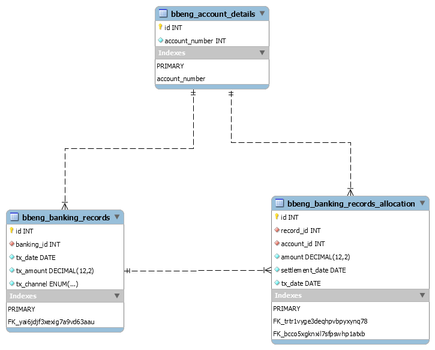

# Database Assignment

#### Database contains three tables

1. bbeng_account_details
2. bbeng_banking_records
3. bbeng_banking_records_allocation

A schema definition is depicted below -

Tables are related to each other through FOREIGN key relations ships.

Table definitions are available [here](https://github.com/dhananjaysinghsengar/Blueoak/blob/master/database-asignment/BlueOak-create-table.sql)

The constraint details are available [here](https://github.com/dhananjaysinghsengar/Blueoak/blob/master/database-asignment/BlueOak-constraints.sql)

#### Questions

1. Provide the SQL query that will list all banking transactions that have not been fully allocated and for each what amount remains to be allocated.

   [Click me for solution](https://github.com/dhananjaysinghsengar/Blueoak/blob/master/database-asignment/BlueOak-select.sql)

1. How would you alter this table structure to improve your query where there are over 1 million payment records and associated allocations?
   1. Indexes should be applies as per below table -
   2. Queries should perform indexed scanning through where clause rather a full scan
   3. Allocated amount should be aggregated only for identified banking id(s)

Please refer to [Query after performance consideration ](https://github.com/dhananjaysinghsengar/Blueoak/blob/master/database-asignment/BlueOak-select.sql)

